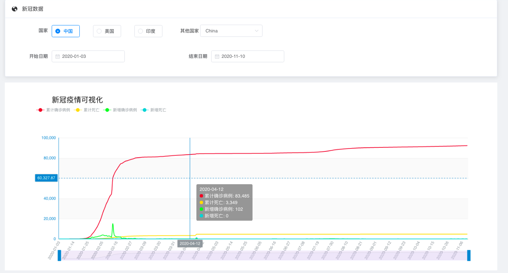
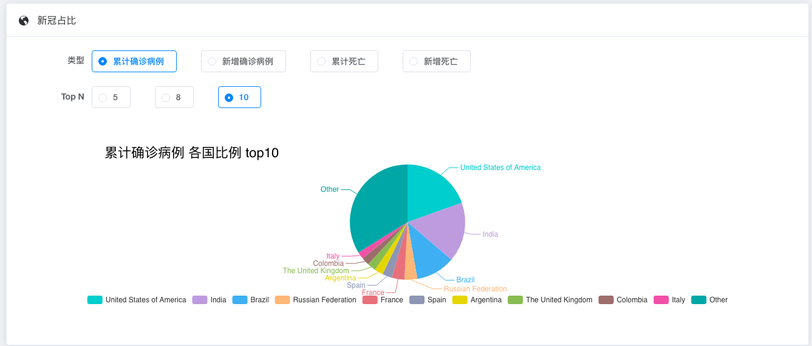
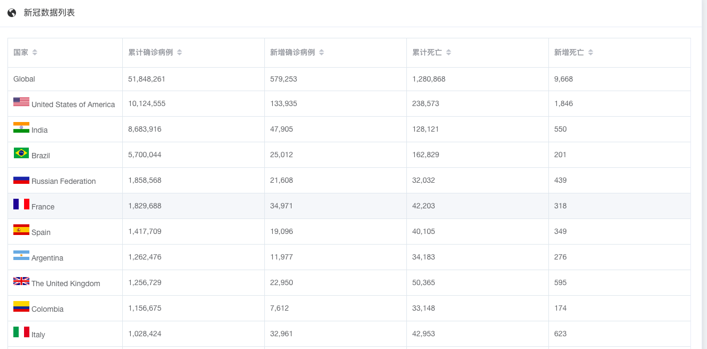

# 卓识投资数据测评项目笔试


## 项目A-新冠肺炎疫情可视化

* 项目描述：寻找公开的covid-19疫情数据，完成数据清理入库、网站前后端开发、重要指标呈现
* 具体要求：
  * 指标：各国每日新增确诊/死亡病例，累计确诊/死亡
  * 可视化使用bar、chart等，比如显示截止当天的各国确诊病例的排名
  * 提供交互，选择可展示日期
  

## 结果展示

https://covid19.atomse.net/


  
## 项目方案

我们选择了提供
* 各国在一定时间段内的`每日新增确诊/死亡病例，累计确诊/死亡数据`查询与可视化
* 最新各个国家`每日新增确诊/死亡病例，累计确诊/死亡数据`的占比
* 最新各个国家`每日新增确诊/死亡病例，累计确诊/死亡数据`的列表显示


具体的设计如下：


### 数据源


数据源选择WHO提供的数据

地址：https://covid19.who.int/table


### 数据清理


我们发现，WHO给出的数据质量足够高，只需要对其标题清除空格即可

```python
df = pd.read_csv("WHO-COVID-19-global-data.csv")
df.columns = [_.strip() for _ in df.columns.values]
```


### 后端

后端使用Django构架，Sqlite3作为数据库，使用Restful接口，给出的资源有

```
/api/v1/allCountries: 所有国家的名称，GET

/api/v1/allDate: 所有可用的日期，GET

/api/v1/dateRange: 日期的最大、最小值，GET

/api/v1/covid19: Covid19 数据
    params = {country: "country", startDate: "startDate", endDate: "endDate"}

api/v1/covid19LatestNumbers: Covid19 各国最新数据
    params = {'topN': 只显示top N的数据, 其他作为Others求和}
```

另外，我们加入了定时更新功能，如果发现当前UTC日期超过了现有数据的最大时间，那么就在后台重新下载并更新当前数据文件。

```
/control/update_covid19: 立即重新下载WHO的Covid19数据并更新数据库
```

可以使用`crontab`定时更新

```text
0 0 * * * curl localhost:8000/control/update_covid19 > /dev/null 2>&1
```

### 前端


在vue-element-admin的基础上修改，完成了三个功能，包括:
* 各国在一定时间段内的`每日新增确诊/死亡病例，累计确诊/死亡数据`查询与可视化
* 最新各个国家`每日新增确诊/死亡病例，累计确诊/死亡数据`的占比
* 最新各个国家`每日新增确诊/死亡病例，累计确诊/死亡数据`的列表显示


#### 各个国家的新冠数据可视化

使用国家的选项卡、开始(结束)日期的选项卡，使用echarts折线图进行可视化。

* 对国家选项卡，首先抓取`/api/v1/allCountries`的数据，并加载到`el-option`。使用`el-radio-group`和`el-option`实现国家的选择。
* `el-date-picker`实现日期的选择，通过获取`/api/v1/dateRange`得到日期的最大、最小值，利用`el-date-picker`自带的`pickerOptions`时间非法日期的屏蔽。
* 对于echarts模块，由于`累计确诊病例`数量较多，因此使用左坐标轴，而对于`新增确诊病例`、`累计死亡`、`新增死亡`，由于其数量较少，远远少于`累计确诊病例`，因此使用右坐标轴。对于`累计确诊病例`，`新增确诊病例`，我们使用折线，而对于`累计死亡`、`新增死亡`，我们使用条形图


将数据传入echarts,数据格式为:

```json
{
    "xData" : ["2020-01-01", "2020-01-02"],
    "yData" : {
        "New_cases" : [100, 200],
        "New_deaths": [1, 2],
        "Cumulative_cases" : [200, 300],
        "Cumulative_deaths" : [50, 100],
    },
    "titleString": "Covid 19 Visualization"
}

```


echarts读取相关的数据并绘图，其中x轴数据较多，使用


```vue
  axisLabel: {
    interval: 10,
    show: true,
    rotate: 60
  },
```
使得x轴每10个数据显示1次，并旋转60度，从而保证x轴数据的间隔，更加美观。


#### 最新各个国家各个项目的占比

使用`el-radio`用于选择类型，包括`每日新增确诊/死亡病例，累计确诊/死亡数据`和top N，使用echarts饼图提供可视化，




#### 最新各个国家的列表显示

使用``显示各个国家的国旗，使用WHO的国旗图片





### 前后端结合

使用nginx进行前后端结合，将api相关的请求进行转发，关键部分配置为
```
    location /prod-api
    {
        proxy_pass http://localhost:8080;
    }
```